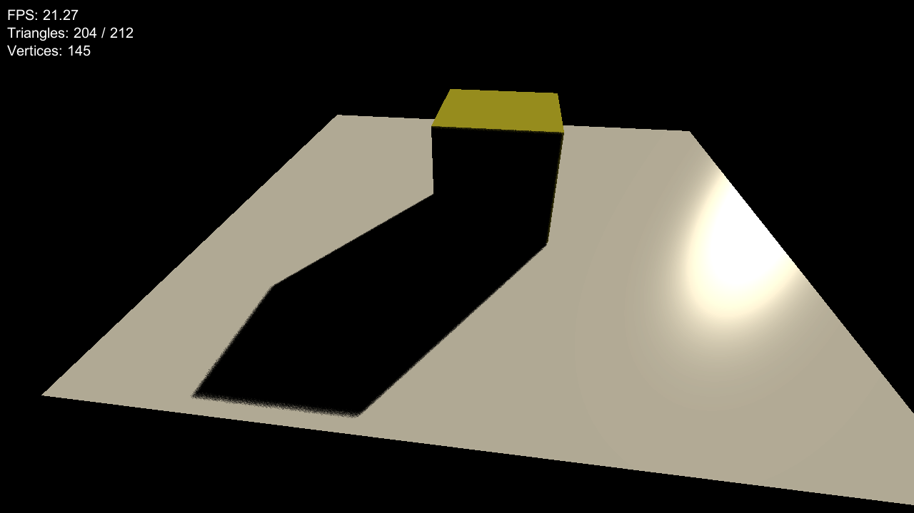
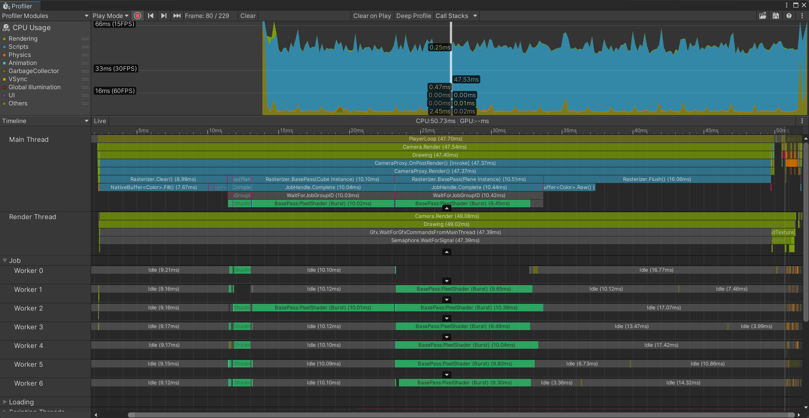

> This is a personal project for testing and learning.

CPU rasterizer based on Unity 2021.3.5f1.

Dependent packeges:
- **Burst** and **Jobs** for parallel rasterization.
- **mathematics** to optimize math calculation.

**Note:** bufffers like `Color[]` and `float[]` in C# could be very slow in filling or clearing, so i use some `NativeArray<>` and **unsafe** memory operations to improve it.

output:

profiler reference:
